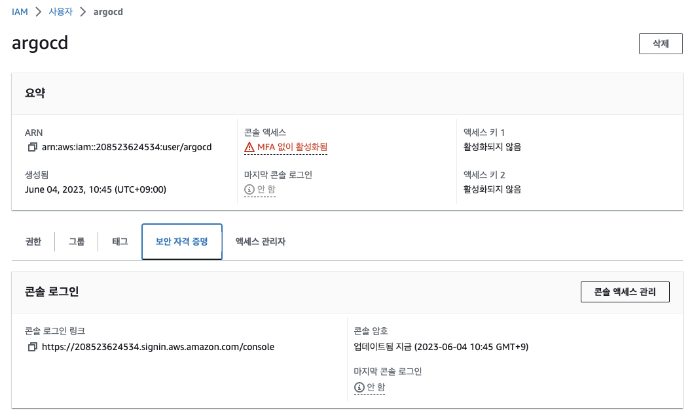

# M2M FlightSpecial Microservice

Monolith 예제인 TravelBuddy 애플리케이션에서 Flight 부분을 분해하여 구현한 마이크로서비스 예제입니다.

## Agenda - Day2

- 이론: Microservice란?
- [Strangler Fig Pattern](./docs/strangler-fig.md) - FlightSpecial 서비스
  - [Docker Compose](./docs/compose.md)
  - [Package 구조](./docs/package.md)
- 실습: [FlightSpecials](https://github.com/shkim4u/m2m-flightspecial) 애플리케이션을 분리
  - Progressive Delivery with ArgoCD
  - Canary Deployment with Argo Rollouts
- 부록: [API Gateway](./docs/apigw.md)
- 부록: [CQRS 패턴](./docs/cqrs.md)

## 1. 로컬에서 둘러보기 가이드

### 데이터베이스 실행

1. (optional) 컨테이너 볼륨 준비

   > 'db'에 컨테이너 볼륨을 사용하고자 한다면 (호스트의 폴더를 마운트하지 않고)

   ```bash
   export DB_VOLUME="db-data"
   docker volume create ${DB_VOLUME}

   # Check
   docker volume ls | egrep "DRIVER|${DB_VOLUME}"
   ```

   > 컨테이너 볼륨을 지우거나 교체하려면

   ```bash
   # replace
   export DB_VOLUME="db-data"
   docker volume rm ${DB_VOLUME}
   docker volume create ${DB_VOLUME}
   ```

2. 데이터베이스 실행

   > (참고) ```docker-compose```가 설치되어 있지 않을 경우 아래 명령을 통해 먼저 설치한 후에 진행합니다.

   ```bash
   sudo curl -L "https://github.com/docker/compose/releases/download/v2.18.1/docker-compose-$(uname -s)-$(uname -m)" -o /usr/local/bin/docker-compose
   sudo chmod +x /usr/local/bin/docker-compose
   ```

   ```bash
   docker-compose up --build -d db

   # Check
   docker-compose ps
   ```

3. DB 스키마 적용(혹은 데이터셋 포함)

   ```bash
   docker-compose run --rm db-init
   ```

4. Clean-up (필요할 때만)

   ```bash
   docker-compose stop db
   docker-compose rm -f db

   # Check
   docker-compose ps -a
   ```

   volume (option)

   ```bash
   # 마운트한 호스트 폴더 정리
   rm -rf env/db/data

   # 컨테이너 볼륨 정리
   docker volume rm ${DB_VOLUME:-db-data}
   ```

### SpringBoot 애플리케이션 실행

#### A. 로컬에서 gradle 활용

> (참고) Java가 설치되어 있지 않을 경우 아래와 같이 Java를 설치합니다.
```bash
sudo yum install -y java-11-amazon-corretto-headless
```

```bash
# 1. Package
./gradlew clean build

# 2. Run Application
./gradlew :interface:bootRun
```

#### B. docker-compose 활용 컨테이너 프로세스로 실행

```bash
# 1. (Optional) 환경변수
export APP_PORT=8080 # default: 8080
export DB_VOLUME="db-data" # 컨테이너 볼륨을 사용하는 경우

# 2. 컨테이너 이미지 빌드 및 실행
docker-compose build app
docker-compose up -d app

# 3. 컨테이너 로그 확인
docker-compose logs -t -f --tail=50 app

# 4. 정리
docker-compose rm app
```

#### Clean up

```bash
docker-compose down

# Remove dangling images
docker rmi $(docker images -f "dangling=true" -q)
# Remove unused docker volumes
docker volume prune
```

## 2. 배포 리포지터리 설정
1. 아래와 같이 Cloud9 환경에서 배포 리포지터리 파일 (Helm)을 클론합니다.<br>

```bash
cd ~/environment/
git clone https://github.com/shkim4u/m2m-flightspecial-helm.git
cd m2m-flightspecial-helm
```

2. 위에서 받은 소스를 배포 리포지터리 (CodeCommit)과 연결합니다.<br>
```bash
export HELM_CODECOMMIT_URL=$(aws codecommit get-repository --repository-name M2M-FlightSpecialCICDStack-DeployStack-DeploySourceRepository --region ap-northeast-2 | grep -o '"cloneUrlHttp": "[^"]*'|grep -o '[^"]*$')
echo $HELM_CODECOMMIT_URL

# CodeCommit 배포 리포지터리(ccorigin으로 명명)와 연결
git remote add ccorigin $HELM_CODECOMMIT_URL

# 배포 리포지터리에 푸시
git push --set-upstream ccorigin main
```

## 3. 빌드 파이프라인 연동


1. 아래와 같이 Cloud9 환경에서 "m2m-flightspecial" 어플리케이션을 클론합니다.<br>

```bash
cd ~/environment
git clone https://github.com/shkim4u/m2m-flightspecial.git
```
2. 빌드 파이프라인 소스 리포지터리의 URL을 확인합니다.<br>
   

3. 위에서 확인한 리포지터리 URL과 현재 소스 코드를 연결합니다.<br>
```bash
# AWS CLI를 통해서도 HTTPS URL을 바로 확인할 수 있습니다.
export APP_CODECOMMIT_URL=$(aws codecommit get-repository --repository-name M2M-FlightSpecialCICDStack-SourceRepository --region ap-northeast-2 | grep -o '"cloneUrlHttp": "[^"]*'|grep -o '[^"]*$')
echo $APP_CODECOMMIT_URL

# CodeCommit 소스 리포지터리(ccorigin으로 명명)와 연결
git remote add ccorigin $APP_CODECOMMIT_URL
# (예시)
# git remote add origin https://git-codecommit.ap-northeast-2.amazonaws.com/v1/repos/M2M-FlightSpecialCICDStack-SourceRepository

# 소스 리포지터리에 푸시
 git push --set-upstream ccorigin main
```

4. 빌드 파이프라인이 성공적으로 수행되는지 확인합니다.<br>
   


## 4. ArgoCD 설정
1. ArgoCD 접속에 필요한 정보 확인 및 접속<br>
CDK를 통해서 이미 배포한 EKS 클러스터에는 ArgCD가 설치되어 있으며, 또한 AWS ELB (Elastic Load Balancer)를 통하여 외부에서 접속할 수 있습니다.<br>

아래와 같이 접속에 필요한 URL과 ```admin``` 암호를 확인합니다.<br>

```bash
# ArgoCD 접속 주소 확인
export ARGOCD_SERVER=`kubectl get svc argocd-server -n argocd -o json | jq --raw-output .status.loadBalancer.ingress[0].hostname`
echo $ARGOCD_SERVER

# ArgoCD의 기본 사용자 (admin) 패스워드 확인
ARGO_PWD=`kubectl -n argocd get secret argocd-initial-admin-secret -o jsonpath="{.data.password}" | base64 -d`
echo $ARGO_PWD
```

확인한 접속 주소와 패스워드를 사용하여 ArgoCD Web UI에 접속해 봅니다.<br>


2. ArgoCD가 빌드 리포지터리에 접속할 수 있도록 IAM 사용자 및 Git Credentials을 생성합니다.<br>
   i. ArgoCD 접속 IAM 사용자 생성<br>
   <br>
   ii. IAM 사용자 권한 지정 - CodeCommit Power User <br>
   <br>
   iii. IAM 사용자 생성 확인<br>
   <br>
   iv. IAM 사용자 보안 자격 증명<br>
   <br>
   v. IAM 사용자 Git Credential 생성<br>
   <br>
   vi. IAM 사용자 Git Credential 메모<br>
   <br>

3. ArgoCD 설정<br>
- 로그인 이후 좌측의 Settings 를 클릭한 뒤 Repositories 항목을 클릭합니다.<br>


- Connect Repo 버튼을 클릭하고 Method는 ```VIA HTTPS```, Project는 ```default```를 입력합니다.<br>

- Repository URL에는 앞서 확인한 배포 CodeCommit Repository의 HTTPS 주소 (예: To ```https://git-codecommit.ap-northeast-2.amazonaws.com/v1/repos/M2M-FlightSpecialCICDStack-DeployStack-DeploySourceRepository```
), Username 및 Password는 메모해 둔 정보를 입력합니다.<br>


- Application 텝에서 NewApp버튼을 클릭합니다. Application Name 에는 ```flightspecials```를, Project는 default를 입력합니다. Sync Policy에는 "Manual"을, Repository URL에는 앞서 설정한 배포 리포지터리를, PATH에는 ```.```을 각각 입력합니다. Destination 섹션의 Cluster URL에는 ```https://kubernetes.default.svc```, Namespace에는 ```flightspecials```를 입력하고 상단의 Create를 클릭합니다.<br>


## 5. ArgoCD 배포 상태 확인<br>
1. ArgoCD 화면에서 FlightSpecials의 배포 상태를 확인합니다.<br>


2. (오류 처리 예) 오류가 발생하였으면 App을 클릭하여 들어가서 자세한 상태를 봅니다.<br>
   <br>
   <br>
- 위에서 보듯 Namespace가 없어서 에러가 발생하였습니다.<br>
- 아래와 같이 Namespace 정의 파일을 생성한 후 배포 리포지터리에 다시 푸시하면 오류가 해소됩니다.<br>
   <br>
   <br>

3. (오류 처리 예) 여전히 Application이 Degrade 상태에 머물러 있을 수 있습니다.<br>
<br>
<br>

위에서 보듯이 Deployment에 Templating된 컨테이너 이미지의 값이 정확하게 풀리지 않음으로써 발생하는 문제입니다.<br>

4. (오류 처리 예) 빌드 파이프라인 수행 시에 빌드되는 컨테이너 이미지를 배포 (Helm) 리포지터리에 주입해 줌으로써 이 문제를 해결하도록 해보겠습니다. 이 작업은 ```m2m-flightspecials``` 프로젝트에서 수행합니다.<br>
핵심 부분은 post_build 부분에 정의된 아래 부분입니다.<br>
   i. 배포 (Helm) 리포를 Git Clone<br>
   ii. Deployment에 주입되는 컨테이너 이미지 정보를 환경 변수로부터 치환<br>
   iii. 배포 리포에 푸시<br>
   iv. ArgoCD가 해당 컨테이너 이미지를 Picking하여 배포<br>
```yaml
...
  post_build:
     commands:
        #      - |
        #        echo "### Pushing container image tag to SSM for reuse ###"
        #        aws ssm put-parameter --name $IMAGE_TAG_KEY --value $IMAGE_TAG --type String --region $REGION --overwrite
        - echo "${IMAGE_TAG}" >> build_output.txt
        - git config --global --replace-all credential.helper '!aws codecommit credential-helper $@'
        - |
             echo "### Update value to manifest repository ###"
                #        [TODO] 이 값도 CodeBuild의 환경변수 혹은 CloudFormation Output으로부터 주입되면 좋습니다.
             git clone https://git-codecommit.ap-northeast-2.amazonaws.com/v1/repos/M2M-FlightSpecialCICDStack-DeployStack-DeploySourceRepository
             cd M2M-FlightSpecialCICDStack-DeployStack-DeploySourceRepository
             ls
             cat values-template.yaml | envsubst > ./values.yaml
             cat ./values.yaml
             git status
             git config user.email "anyone@example.com"
             git config user.name "FlightSpecial Developer"
             git add .
             git commit -m "Updated image tag to $IMAGE_TAG"
             git log --oneline
             git remote -v
             git push -u origin main
...
```


5. (옵션) Parameter Store/Secrets Manager 접근 권한 부족 - IRSA (IAM Role for) 설정 필요<br>


6. (오류 처리 예) 빌드 파이프라인을 통해 컨테이너 이미지 정보가 정확하게 Deployment 명세로 주입이되면 Pod가 기동됨을 알 수 있습니다.<br>

하지만 아래와 같이 Database 접속이 되지 않음에 따라 어플리케이션 기동이 실패하고, Pod가 재시작을 반복하면서 CrashLoopBackoff 단계에 빠진 것을 알 수 있습니다.<br>

<br>

<br>

데이터베이스 정보를 주입해 줌으로써 이를 해소해 보겠습니다.

7. 데이터베이스 정보 주입<br>
동적인 환경으로부터 설정값을 가져오는 방법은 여러가지가 있지만 여기에서는 다시 빌드 시 데이터베이스 엔드포인트와 포트는 CloudFormation으로부터, 그리고 데이터베이스 사용자 및 암호는 Secrets Manager로부터 얻어온 후 이 값으로 배포 Helm Chat의 values.template을 업데이트해 주기로 하였습니다.<br>
```bash
# buildspec,yaml 파일으 28 ~ 32번째 줄...
...
      - echo "### Retrieving database information..."
      - export DATABASE_ENDPOINT=`aws cloudformation describe-stacks --region ${AWS_REGION} --query "Stacks[?StackName=='M2M-FlightSpecialDatabaseStack'][].Outputs[?OutputKey=='M2MFlightSpecialDatabaseStackFlightSpecialDBEndpoint'].OutputValue" --output text`;
      - export DATABASE_PORT=`aws cloudformation describe-stacks --region ${AWS_REGION} --query "Stacks[?StackName=='M2M-FlightSpecialDatabaseStack'][].Outputs[?OutputKey=='M2MFlightSpecialDatabaseStackFlightSpecialDBPort'].OutputValue" --output text`;
#      - [TODO] DATABASE_USERNAME: Currently fixed from secrets manager.
      - export DATABASE_USERNAME=flightspecial_db_credentials_test
...
```


이렇게 설정된 값은 다음과 같은 경로로 전파됩니다.<br>
> values.yaml -> deployment.yaml -> 컨테이너의 환경 변수 -> 어플리케이션의 applications.yaml 파일에서 Replace되어 Property Value 처리 로직에 따라 해석됨 

8. Secrets Manager 및 Parameter Store 의존성 설정<br>
아래와 같이 Secrets Manager 및 Parameter Store의 의존성을 설정해 줍니다.<br>


9. (옵션) Secrets Manager 및 Parameter Store 권한 설정<br>
IRSA (IAM Role for Service Account) 혹은 Node Role에 아래와 같이 권한을 지정해 줍니다.<br>


10. (옵션) PostgreSQL 데이터베이스 확인<br>

FlightSpecials 어플리케이션은 최초 기동 시에 데이터베이스 스키마를 설정하고 샘플 데이터를 주입하도록 설정되어 있습니다 (via Flyway). 하지만 이 과정이 실패할 경우 아래와 같이 PostgreSQL 클라이언트를 (서버에 포함) 설치하고 Troubleshooting해 볼 수 있습니다.<br> 
```bash
sudo yum update -y
sudo amazon-linux-extras enable postgresql14
sudo yum install postgresql-server -y

psql -h 서버주소 -U 아이디 데이터베이스명
# (예) psql -h travelbuddy-test-postgres-db.ceamvivkqhbk.ap-northeast-2.rds.amazonaws.com -U postgres travelbuddy
```

11. 분리된 FlightSpecials 마이크로서비스가 동작하는 것을 확인합니다.<br>


우리는 TravelBuddy 실습 중에 생성한 ALB가 공유됨을 주목할 필요가 있습니다.<br>


## 6. Argo Rollouts을 통한 Canary 배포<br>
우리는 TravelBuddy Monolith 어플리케이션으로부터 FlightSpecials 서비스의 백엔드 기능을 API로 분리하고 이를 ArgoCD를 활용한 GitOps 체계로 배포할 수 있었습니다.

하지만 현재 배포된 FlightSpecials 백엔드 기능은 각 FlightSpecials 항목의 이름을 수정하는 기능이 누락된 것이 발견되었습니다.

FlightSpecials 마이크로서비스의 PO (Product Owner)는 Progressive Delivery & Deploy를 적용하기 위하여 Argo Rollouts을 적용해 보고 싶어합니다. 

앞서 CDK로 배포한 자원에는 이미 Argo Rollouts 컨트롤러가 설치되어 있습니다.<br>
이를 활용하여 FlightSpecials에 대한 Canary 배포를 적용해 보기로 하겠습니다.<br>

1. (옵션) Argo Rollouts Dashboard 사용을 위해 Plugin 설치<br>
우리는 이미 대시보드를 설치해 두었으므로 아래 Kubectl Plugin은 옵션으로 설치합니다.<br>
 ```bash
 curl -LO https://github.com/argoproj/argo-rollouts/releases/latest/download/kubectl-argo-rollouts-linux-amd64
 chmod +x ./kubectl-argo-rollouts-linux-amd64
 sudo mv ./kubectl-argo-rollouts-linux-amd64 /usr/local/bin/kubectl-argo-rollouts
 kubectl argo rollouts version
 ```

2. Argo Rollouts 대시보드 확인<br>
```bash
kubectl get services argo-rollouts-dashboard -n argo-rollouts -o=jsonpath={.status.loadBalancer.ingress[0].hostname} | awk '{print $1}'
```

3. 위에서 확인한 ```http://<Argo Rollouts Dashboard URL>:3100```으로 접속해 봅니다.<br>


4. 해당 기능이 구현된 소스를 다운받습니다. 이 기능은 강사에 의해 미리 구현되어 원본 Github Repository의```feature/update-header` 브랜치에 올라가 있습니다.


4. 배포 리포지터리의 Deployment 파일을 아래와 같이 변경하고 Rollouts 객체가 정상적으로 동작하는지 확인합니다.<br>
```bash
# deployment.yaml
apiVersion: argoproj.io/v1alpha1
*kind: Rollout
metadata:
  namespace: {{ .Values.namespace.name }}
  name: {{ .Values.deployment.name }}
spec:
  replicas: {{ .Values.deployment.replicas }}
  selector:
    matchLabels:
      app.kubernetes.io/name: {{ .Values.app.name }}
  template:
    metadata:
      labels:
        app.kubernetes.io/name: {{ .Values.app.name }}
    spec:
      serviceAccountName: flightspecials-service-account
      containers:
        - image: "{{ .Values.image.repository }}:{{ .Values.image.tag }}"
          name: {{ .Values.app.name }}
          imagePullPolicy: Always
          ports:
            - containerPort: {{ .Values.container.port }}
              protocol: TCP
          resources:
            requests:
              memory: "256Mi"
              cpu: "250m"
            limits:
              memory: "512Gi"
              cpu: "500m"
          env:
            - name: PROFILE
              valueFrom:
                configMapKeyRef:
                  key: environment
                  name: flightspecials-configmap
            - name: JAVA_OPTIONS
              value: "-Dspring.profiles.active=${SPRING_PROFILES_ACTIVE}"
            - name: SPRING_PROFILES_ACTIVE
              valueFrom:
                configMapKeyRef:
                  key: environment
                  name: flightspecials-configmap
            - name: DATABASE_ENDPOINT
              valueFrom:
                configMapKeyRef:
                  key: database_endpoint
                  name: flightspecials-configmap
            - name: DATABASE_PORT
              valueFrom:
                configMapKeyRef:
                  key: database_port
                  name: flightspecials-configmap
            - name: DATABASE_USERNAME
              valueFrom:
                configMapKeyRef:
                  key: database_username
                  name: flightspecials-configmap
            - name: DB_DEFAULT_SCHEMA
              value: travelbuddy
  strategy:
    canary:
      maxSurge: "50%"    # canary 배포로 생성할 pod의 비율*/
      maxUnavailable: 0  # 업데이트 될 때 사용할 수 없는 pod의 최대 수*/
      steps:*/}}
        - setWeight: 20*/}}
        - pause: {duration: 30s}*/}}
        - setWeight: 40*/}}
        - pause: {duration: 30s}*/}}
        - setWeight: 60*/}}
        - pause: {duration: 30s}*/}}
        - setWeight: 80*/}}
        - pause: {duration: 20s}*/}}
  revisionHistoryLimit: 2*/}}
```

5. 어플리케이션을 신규 배포하면서 Canary 배포가 동작함을 확인합니다.<br>


