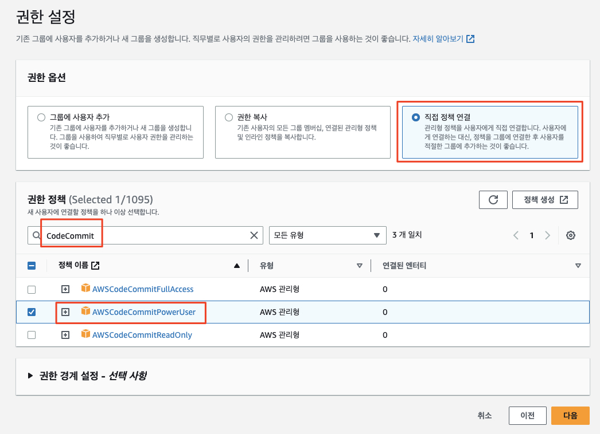
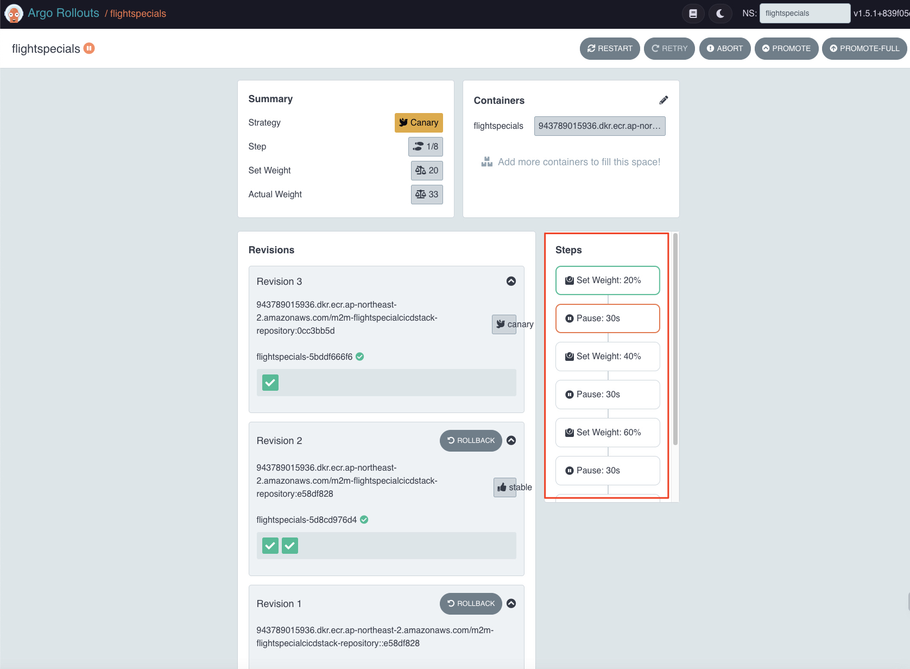

# M2M FlightSpecial Microservice

Monolith 예제인 TravelBuddy 애플리케이션에서 Flight 부분을 분해하여 구현한 마이크로서비스 예제입니다.

## Agenda - Day2

- 이론: Microservice란?
- [Strangler Fig Pattern](./docs/strangler-fig.md) - FlightSpecial 서비스
  - [Docker Compose](./docs/compose.md)
  - [Package 구조](./docs/package.md)
- 실습: [FlightSpecials](https://github.com/shkim4u/m2m-flightspecial) 애플리케이션을 분리
  - Progressive Delivery with ArgoCD
  - Canary Deployment with Argo Rollouts
- 부록: [API Gateway](./docs/apigw.md)
- 부록: [CQRS 패턴](./docs/cqrs.md)

## 0. Day 2 자원 배포하기 (Cloud9)
우리는 이미 네트워크, EKS, 레거시 데이터베이스 (MySQL)과 같은 Day 1 자원을 배포하였고, 여기에서 모놀리스 어플리케이션을 살펴보았습니다.<br>

이번에는 마이크로서비스 분리를 위하여 Day 2 자원을 배포해 보도록 하겠습니다.<br>
### 0.1. CDK를 사용하는 경우
```bash
cd ~/environment/m2m-travelbuddy/infrastructure-cdk

# Private CA ARN을 설정합니다. 이는 ALB 설정에 필요합니다.
export CA_ARN_QUOTED=`aws acm-pca list-certificate-authorities --query 'CertificateAuthorities[?Status==\`ACTIVE\`].Arn | [0]'`
export CA_ARN=`echo $CA_ARN_QUOTED | tr -d '"'`
echo $CA_ARN

npm run day2
```

### 0.2. 테라폼을 사용하는 경우
```bash
# 테라폼 디렉토리로 이동
cd ~/environment/m2m-travelbuddy/infrastructure-terraform

# CA_ARN 확인
export TF_VAR_ca_arn=`terraform output eks_ca_arn | tr -d '"'`
echo $TF_VAR_ca_arn


# terraform apply
terraform apply -var='exclude_msk=false' -auto-approve
```

## 1. 로컬에서 둘러보기 (Cloud9)

Cloud9 환경에서 ```FlightSpecials``` 마이크로서비스 소스 코드를 Clone합니다.<br>
```bash
cd ~/environment/
git clone https://github.com/shkim4u/m2m-flightspecial.git
cd m2m-flightspecial
```

### 데이터베이스 실행

1. (Optional) 컨테이너 볼륨 준비

   > 'db'에 컨테이너 볼륨을 사용하고자 한다면 (호스트의 폴더를 마운트하지 않고)

   ```bash
   export DB_VOLUME="db-data"
   docker volume create ${DB_VOLUME}

   # Check
   docker volume ls | egrep "DRIVER|${DB_VOLUME}"
   ```

   > 컨테이너 볼륨을 지우거나 교체하려면

   ```bash
   # replace
   export DB_VOLUME="db-data"
   docker volume rm ${DB_VOLUME}
   docker volume create ${DB_VOLUME}
   ```

2. 데이터베이스 실행

   > (참고) ```docker-compose```가 설치되어 있지 않을 경우 아래 명령을 통해 먼저 설치한 후에 진행합니다.

   ```bash
   sudo curl -L "https://github.com/docker/compose/releases/download/v2.18.1/docker-compose-$(uname -s)-$(uname -m)" -o /usr/local/bin/docker-compose
   sudo chmod +x /usr/local/bin/docker-compose
   ```

   ```bash
   docker-compose up --build -d db

   # Check
   docker-compose ps
   ```

3. DB 스키마 적용(혹은 데이터셋 포함)

   ```bash
   docker-compose run --rm db-init
   ```

4. Clean-up (필요할 때만)

   ```bash
   docker-compose stop db
   docker-compose rm -f db

   # Check
   docker-compose ps -a
   ```

   volume (option)

   ```bash
   # 마운트한 호스트 폴더 정리
   rm -rf env/db/data

   # 컨테이너 볼륨 정리
   docker volume rm ${DB_VOLUME:-db-data}
   ```

### SpringBoot 애플리케이션 실행

#### Option 1. docker-compose 활용 컨테이너 프로세스로 실행

```bash
# 1. (Optional) 환경변수
export APP_PORT=8080 # default: 8080
export DB_VOLUME="db-data" # 컨테이너 볼륨을 사용하는 경우

# 2. 컨테이너 이미지 빌드 및 실행
./gradlew clean build -x test
docker-compose build app
docker-compose up -d app

# 3. 컨테이너 로그 확인
docker-compose logs -t -f --tail=50 app

# 4. FlightSpecials Endpoint 확인
curl http://localhost:8080/flightspecials/

# 4. 정리
docker-compose stop app
docker-compose rm app
```

#### Option 2. 로컬에서 gradle 활용

> (참고) Java가 설치되어 있지 않을 경우 아래와 같이 Java를 설치합니다.
```bash
sudo yum install -y java-11-amazon-corretto-headless
```

```bash
# 1. Package
./gradlew clean build -x test

# 2. Run Application
./gradlew :interface:bootRun
```

#### Clean up

```bash
docker-compose down

# Remove dangling images
docker rmi $(docker images -f "dangling=true" -q)
# Remove unused docker volumes
docker volume prune
```

## 2. 배포 리포지터리 설정
1. 아래와 같이 Cloud9 환경에서 배포 리포지터리 파일 (Helm)을 클론합니다.<br>

```bash
cd ~/environment/
git clone https://github.com/shkim4u/m2m-flightspecial-helm.git
cd m2m-flightspecial-helm
```

2. 위에서 받은 소스를 배포 리포지터리 (CodeCommit)과 연결합니다.<br>
   1. CDK를 통해 자원을 생성하였을 경우
   ```bash
   export HELM_CODECOMMIT_URL=$(aws codecommit get-repository --repository-name M2M-FlightSpecialCICDStack-DeployStack-DeploySourceRepository --region ap-northeast-2 | grep -o '"cloneUrlHttp": "[^"]*'|grep -o '[^"]*$')
   echo $HELM_CODECOMMIT_URL
   
   # CodeCommit 배포 리포지터리(ccorigin으로 명명)와 연결
   git remote add ccorigin $HELM_CODECOMMIT_URL
   
   # 배포 리포지터리에 푸시
   git push --set-upstream ccorigin main
   ```

   2. 테라폼을 통해 자원을 생성하였을 경우
   ```bash
   export HELM_CODECOMMIT_URL=$(aws codecommit get-repository --repository-name flightspecials-configuration --region ap-northeast-2 | grep -o '"cloneUrlHttp": "[^"]*'|grep -o '[^"]*$')
   echo $HELM_CODECOMMIT_URL
   
   # CodeCommit 배포 리포지터리(ccorigin으로 명명)와 연결
   git remote add ccorigin $HELM_CODECOMMIT_URL
   
   # 배포 리포지터리에 푸시
   git push --set-upstream ccorigin main
   ```


## 3. 빌드 파이프라인 연동


1. (Skip 가능) 위 과정에서 아래와 같이 Cloud9 환경에서 "m2m-flightspecial" 어플리케이션을 클론합니다.<br>

```bash
cd ~/environment
git clone https://github.com/shkim4u/m2m-flightspecial.git
cd m2m-flightspecial
```

2. ~~빌드 파이프라인 소스 리포지터리의 URL을 확인합니다.~~<br>
   

3. 소스 리포지터리를 현재 소스 코드와 연결합니다.<br>
   1. CDK를 사용하였을 경우<br>
   ```bash
   cd ~/environment/m2m-flightspecial
   
   # AWS CLI를 통해서도 HTTPS URL을 바로 확인할 수 있습니다.
   export APP_CODECOMMIT_URL=$(aws codecommit get-repository --repository-name M2M-FlightSpecialCICDStack-SourceRepository --region ap-northeast-2 | grep -o '"cloneUrlHttp": "[^"]*'|grep -o '[^"]*$')
   echo $APP_CODECOMMIT_URL
   
   # CodeCommit 소스 리포지터리(ccorigin으로 명명)와 연결
   git remote add ccorigin $APP_CODECOMMIT_URL
   
   # 소스 리포지터리에 푸시
   git push --set-upstream ccorigin main
   ```
   2. 테라폼을 사용하였을 경우<br>
   ```bash
   cd ~/environment/m2m-flightspecial
   
   # AWS CLI를 통해서도 HTTPS URL을 바로 확인할 수 있습니다.
   export APP_CODECOMMIT_URL=$(aws codecommit get-repository --repository-name flightspecials-application --region ap-northeast-2 | grep -o '"cloneUrlHttp": "[^"]*'|grep -o '[^"]*$')
   echo $APP_CODECOMMIT_URL
   
   # CodeCommit 소스 리포지터리(ccorigin으로 명명)와 연결
   git remote add ccorigin $APP_CODECOMMIT_URL
   
   # 소스 리포지터리에 푸시
   git push --set-upstream ccorigin main
   ```

4. 빌드 파이프라인이 성공적으로 수행되는지 확인합니다.<br>
   (CDK를 사용하였을 경우)<br>
    <br>
   (혹은 테라폼을 사용하였을 경우)<br>
    <br>

<u>***(오류 해결) 만약 파이프라인에서 오류가 발생하면 오류 로그를 살펴본 후 이를 해결해 봅니다.***</u><br>

## 4. ArgoCD 설정
1. ArgoCD 접속에 필요한 정보 확인 및 접속<br>
CDK나 테라폼을 통해서 이미 배포한 EKS 클러스터에는 ArgCD가 설치되어 있으며, 또한 AWS ELB (Elastic Load Balancer)를 통하여 외부에서 접속할 수 있습니다.<br>

아래와 같이 접속에 필요한 URL과 ```admin``` 암호를 확인합니다.<br>

```bash
# ArgoCD 접속 주소 확인
export ARGOCD_SERVER=`kubectl get ingress/argocd-server -n argocd -o json | jq --raw-output .status.loadBalancer.ingress[0].hostname`
echo https://${ARGOCD_SERVER}

# ArgoCD의 기본 사용자 (admin) 패스워드 확인
ARGO_PWD=`kubectl -n argocd get secret argocd-initial-admin-secret -o jsonpath="{.data.password}" | base64 -d`
echo $ARGO_PWD
```

확인한 접속 주소와 패스워드를 사용하여 ArgoCD Web UI에 접속해 봅니다.<br>


2. ArgoCD가 빌드 리포지터리에 접속할 수 있도록 IAM 사용자 및 Git Credentials을 생성합니다 (CLI 사용).<br>
```bash
# IAM User 생성
aws iam create-user --user-name argocd 

# AWSCodeCommitPowerUser 관리형 권한 정책 연결 (arn:aws:iam::aws:policy/AWSCodeCommitPowerUser)
aws iam attach-user-policy --user-name argocd --policy-arn arn:aws:iam::aws:policy/AWSCodeCommitPowerUser

# CodeCommit 접근을 위한 Specific Credential 생성
# (중요) 결과로서 반환되는 "ServiceUserName"과 "ServicePassword"를 기록해 둡니다.
aws iam create-service-specific-credential --user-name argocd --service-name codecommit.amazonaws.com
```

3. 혹은 콘솔 화면에서 아래와 같이 수행할 수 있습니다.<br>
   i. ArgoCD 접속 IAM 사용자 생성<br>
   <br>
   ii. IAM 사용자 권한 지정 - CodeCommit Power User <br>
   <br>
   iii. IAM 사용자 생성 확인<br>
   <br>
   iv. IAM 사용자 보안 자격 증명<br>
   <br>
   v. IAM 사용자 Git Credential 생성<br>
   <br>
   vi. IAM 사용자 Git Credential 메모<br>
   <br>

4. ArgoCD 설정<br>
- 로그인 이후 좌측의 Settings 를 클릭한 뒤 Repositories 항목을 클릭합니다.<br>


- Connect Repo 버튼을 클릭하고 Method는 ```VIA HTTPS```, Project는 ```default```를 입력합니다.<br>

- Repository URL에는 앞서 확인한 배포 CodeCommit Repository의 HTTPS 주소와 Username 및 Password는 메모해 둔 정보를 입력합니다.<br>
  (CDK 사용 시)
   ```bash
   export HELM_CODECOMMIT_URL=$(aws codecommit get-repository --repository-name M2M-FlightSpecialCICDStack-DeployStack-DeploySourceRepository --region ap-northeast-2 | grep -o '"cloneUrlHttp": "[^"]*'|grep -o '[^"]*$')
   echo $HELM_CODECOMMIT_URL
   ```
  (테라폼 사용 시)
   ```bash
   export HELM_CODECOMMIT_URL=$(aws codecommit get-repository --repository-name flightspecials-configuration --region ap-northeast-2 | grep -o '"cloneUrlHttp": "[^"]*'|grep -o '[^"]*$')
   echo $HELM_CODECOMMIT_URL
   ```


- Application 텝에서 NewApp버튼을 클릭합니다. Application Name 에는 ```flightspecials```를, Project는 ```default```를 입력합니다. Sync Policy에는 "Manual"을, Repository URL에는 앞서 설정한 배포 리포지터리를, PATH에는 ```.```을 각각 입력합니다. Destination 섹션의 Cluster URL에는 ```https://kubernetes.default.svc```, Namespace에는 ```flightspecials```를 입력하고 상단의 Create를 클릭합니다.<br>


## 5. ArgoCD 배포 상태 확인<br>
1. ArgoCD 화면에서 FlightSpecials의 배포 상태를 확인합니다.<br>


2. (오류 처리 예) 오류가 발생하였으면 App을 클릭하여 들어가서 자세한 상태를 봅니다.<br>
   <br>
   <br>
- 위에서 보듯 Namespace가 없어서 에러가 발생하였습니다.<br>
- 아래와 같이 Namespace 정의 파일을 생성한 후 배포 리포지터리에 다시 푸시하면 오류가 해소됩니다.<br>
   <br>
   <br>

3. (오류 처리 예) 여전히 Application이 Degrade 상태에 머물러 있을 수 있습니다.<br>
<br>
<br>

위에서 보듯이 Deployment에 Templating된 컨테이너 이미지의 값이 정확하게 풀리지 않음으로써 발생하는 문제입니다.<br>

4. (오류 처리 예) 빌드 파이프라인 수행 시에 빌드되는 컨테이너 이미지를 배포 (Helm) 리포지터리에 주입해 줌으로써 이 문제를 해결하도록 해보겠습니다. 이 작업은 ```m2m-flightspecials``` 프로젝트에서 수행합니다.<br>
핵심 부분은 post_build 부분에 정의된 아래 부분입니다.<br>
   i. 배포 (Helm) 리포를 Git Clone<br>
   ii. Deployment에 주입되는 컨테이너 이미지 정보를 환경 변수로부터 치환<br>
   iii. 배포 리포에 푸시<br>
   iv. ArgoCD가 해당 컨테이너 이미지를 Picking하여 배포<br>
```yaml
...
  post_build:
     commands:
        #      - |
        #        echo "### Pushing container image tag to SSM for reuse ###"
        #        aws ssm put-parameter --name $IMAGE_TAG_KEY --value $IMAGE_TAG --type String --region $REGION --overwrite
        - echo "${IMAGE_TAG}" >> build_output.txt
        - git config --global --replace-all credential.helper '!aws codecommit credential-helper $@'
        - |
             echo "### Update value to manifest repository ###"
                #        [TODO] 이 값도 CodeBuild의 환경변수 혹은 CloudFormation Output으로부터 주입되면 좋습니다.
             git clone https://git-codecommit.ap-northeast-2.amazonaws.com/v1/repos/M2M-FlightSpecialCICDStack-DeployStack-DeploySourceRepository
             cd M2M-FlightSpecialCICDStack-DeployStack-DeploySourceRepository
             ls
             cat values-template.yaml | envsubst > ./values.yaml
             cat ./values.yaml
             git status
             git config user.email "anyone@example.com"
             git config user.name "FlightSpecial Developer"
             git add .
             git commit -m "Updated image tag to $IMAGE_TAG"
             git log --oneline
             git remote -v
             git push -u origin main
...
```


5. (옵션) Parameter Store/Secrets Manager 접근 권한 부족 - IRSA (IAM Role for) 설정 필요<br>


6. (오류 처리 예) 빌드 파이프라인을 통해 컨테이너 이미지 정보가 정확하게 Deployment 명세로 주입이되면 Pod가 기동됨을 알 수 있습니다.<br>

하지만 아래와 같이 Database 접속이 되지 않음에 따라 어플리케이션 기동이 실패하고, Pod가 재시작을 반복하면서 CrashLoopBackoff 단계에 빠진 것을 알 수 있습니다.<br>

<br>

<br>

데이터베이스 정보를 주입해 줌으로써 이를 해소해 보겠습니다.

7. 데이터베이스 정보 주입<br>
동적인 환경으로부터 설정값을 가져오는 방법은 여러가지가 있지만 여기에서는 다시 빌드 시 데이터베이스 엔드포인트와 포트는 CloudFormation으로부터, 그리고 데이터베이스 사용자 및 암호는 Secrets Manager로부터 얻어온 후 이 값으로 배포 Helm Chat의 values.template을 업데이트해 주기로 하였습니다.<br>
```bash
# buildspec,yaml 파일으 28 ~ 32번째 줄...
...
      - echo "### Retrieving database information..."
      - export DATABASE_ENDPOINT=`aws cloudformation describe-stacks --region ${AWS_REGION} --query "Stacks[?StackName=='M2M-FlightSpecialDatabaseStack'][].Outputs[?OutputKey=='M2MFlightSpecialDatabaseStackFlightSpecialDBEndpoint'].OutputValue" --output text`;
      - export DATABASE_PORT=`aws cloudformation describe-stacks --region ${AWS_REGION} --query "Stacks[?StackName=='M2M-FlightSpecialDatabaseStack'][].Outputs[?OutputKey=='M2MFlightSpecialDatabaseStackFlightSpecialDBPort'].OutputValue" --output text`;
#      - [TODO] DATABASE_USERNAME: Currently fixed from secrets manager.
      - export DATABASE_USERNAME=flightspecial_db_credentials_test
...
```


이렇게 설정된 값은 다음과 같은 경로로 전파됩니다.<br>
> values.yaml -> deployment.yaml -> 컨테이너의 환경 변수 -> 어플리케이션의 applications.yaml 파일에서 Replace되어 Property Value 처리 로직에 따라 해석됨 

8. Secrets Manager 및 Parameter Store 의존성 설정<br>
아래와 같이 Secrets Manager 및 Parameter Store의 의존성을 설정해 줍니다.<br>


9. (옵션) Secrets Manager 및 Parameter Store 권한 설정<br>
IRSA (IAM Role for Service Account) 혹은 Node Role에 아래와 같이 권한을 지정해 줍니다.<br>


10. (옵션) PostgreSQL 데이터베이스 확인<br>

FlightSpecials 어플리케이션은 최초 기동 시에 데이터베이스 스키마를 설정하고 샘플 데이터를 주입하도록 설정되어 있습니다 (via Flyway). 하지만 이 과정이 실패할 경우 아래와 같이 PostgreSQL 클라이언트를 (서버에 포함) 설치하고 Troubleshooting해 볼 수 있습니다.<br> 
```bash
sudo yum update -y
sudo amazon-linux-extras enable postgresql14
sudo yum install postgresql-server -y

psql -h 서버주소 -U 아이디 데이터베이스명
# (예) psql -h travelbuddy-test-postgres-db.ceamvivkqhbk.ap-northeast-2.rds.amazonaws.com -U postgres travelbuddy
```

11. 분리된 FlightSpecials 마이크로서비스가 동작하는 것을 확인합니다.<br>

```bash
export API_URL=http://$(kubectl get ingress/travelbuddy-ingress -n travelbuddy -o jsonpath='{.status.loadBalancer.ingress[*].hostname}')
echo ${API_URL}/flightspecials/

curl ${API_URL}/flightspecials/
```


우리는 TravelBuddy 실습 중에 생성한 ALB가 공유됨을 주목할 필요가 있습니다.<br>


## 6. Argo Rollouts을 통한 Canary 배포<br>
우리는 TravelBuddy Monolith 어플리케이션으로부터 FlightSpecials 서비스의 백엔드 기능을 API로 분리하고 이를 ArgoCD를 활용한 GitOps 체계로 배포할 수 있었습니다.

하지만 현재 배포된 FlightSpecials 백엔드 기능은 각 FlightSpecials 항목의 이름을 수정하는 기능이 누락된 것이 발견되었습니다.

다음과 같이 특정 FlightSpecials 항목의 헤더를 업데이트하는 REST API가 404로 반환됨을 확인합니다.

```bash
export API_URL=http://$(kubectl get ingress/travelbuddy-ingress -n travelbuddy -o jsonpath='{.status.loadBalancer.ingress[*].hostname}')
echo $API_URL/flightspecials/1/header

curl --location ${API_URL}/flightspecials/1/header \
--header 'Content-Type: application/json' \
--data '{
    "id": 1,
    "flightSpecialHeader": "London to Seoul"
}'
```


FlightSpecials 마이크로서비스의 PO (Product Owner)는 Progressive Delivery & Deploy를 적용하기 위하여 Argo Rollouts을 적용해 보고 싶어합니다. 

앞서 CDK 혹은 테라폼으로 배포한 자원에는 이미 Argo Rollouts 컨트롤러가 설치되어 있습니다.<br>
이를 활용하여 FlightSpecials에 대한 Canary 배포를 적용해 보기로 하겠습니다.<br>

1. (옵션) Argo Rollouts Dashboard 사용을 위해 Plugin 설치<br>
우리는 이미 대시보드를 설치해 두었으므로 아래 Kubectl Plugin은 옵션으로 설치합니다.<br>
```bash
curl -LO https://github.com/argoproj/argo-rollouts/releases/latest/download/kubectl-argo-rollouts-linux-amd64
chmod +x ./kubectl-argo-rollouts-linux-amd64
sudo mv ./kubectl-argo-rollouts-linux-amd64 /usr/local/bin/kubectl-argo-rollouts
kubectl argo rollouts version
```

2. Argo Rollouts 대시보드 확인<br>
```bash
# Argo Rollouts 접속 주소 확인
export ARGO_ROLLOUTS_DASHBOARD_URL=`kubectl get ingress/argo-rollouts-dashboard -n argo-rollouts -o json | jq --raw-output .status.loadBalancer.ingress[0].hostname`
echo http://${ARGO_ROLLOUTS_DASHBOARD_URL}/rollouts 
```

3. 위에서 확인한 ```http://<Argo Rollouts Dashboard URL>```으로 접속해 봅니다.<br>
> (참고)
> Argo Rollouts의 기본 포트는 3100이지만, CDK 혹은 테라폼 Addon으로 배포된 Ingress는 80으로 설정되었습니다.


4. 배포 리포지터리의 Deployment 파일을 아래와 같이 변경하고 Rollouts 객체가 정상적으로 동작하는지 확인합니다.<br>
```bash
# 빌드 파이프라인인 배포 파일을 변경하였으므로 먼저 변경 사항을 Pull합니다.
cd ~/environment/m2m-flightspecial-helm
git pull

# Cloud9 CLI로 deployment.yaml 파일을 엽니다.
c9 open templates/deployment.yaml
```

위에서 열린 Deployment 매니페스트의 내용 전체를 아래 Argo Rollouts 매니페스트 파일로 변경합니다.

```yaml
apiVersion: argoproj.io/v1alpha1
kind: Rollout
metadata:
  namespace: {{ .Values.namespace.name }}
  name: {{ .Values.deployment.name }}
spec:
  replicas: {{ .Values.deployment.replicas }}
  selector:
    matchLabels:
      app.kubernetes.io/name: {{ .Values.app.name }}
  template:
    metadata:
      labels:
        app.kubernetes.io/name: {{ .Values.app.name }}
    spec:
      serviceAccountName: flightspecials-service-account
      containers:
        - image: "{{ .Values.image.repository }}:{{ .Values.image.tag }}"
          name: {{ .Values.app.name }}
          imagePullPolicy: Always
          ports:
            - containerPort: {{ .Values.container.port }}
              protocol: TCP
          resources:
            requests:
              memory: "256Mi"
              cpu: "250m"
            limits:
              memory: "2048Mi"
              cpu: "1000m"
          env:
            - name: PROFILE
              valueFrom:
                configMapKeyRef:
                  key: environment
                  name: flightspecials-configmap
            - name: JAVA_OPTIONS
              value: "-Dspring.profiles.active=${SPRING_PROFILES_ACTIVE}"
            - name: SPRING_PROFILES_ACTIVE
              valueFrom:
                configMapKeyRef:
                  key: environment
                  name: flightspecials-configmap
            - name: DATABASE_ENDPOINT
              valueFrom:
                configMapKeyRef:
                  key: database_endpoint
                  name: flightspecials-configmap
            - name: DATABASE_PORT
              valueFrom:
                configMapKeyRef:
                  key: database_port
                  name: flightspecials-configmap
            - name: DATABASE_USERNAME
              valueFrom:
                configMapKeyRef:
                  key: database_username
                  name: flightspecials-configmap
            - name: DB_DEFAULT_SCHEMA
              value: travelbuddy
  strategy:
    canary:
      maxSurge: "50%"    # canary 배포로 생성할 pod의 비율*/
      maxUnavailable: 0  # 업데이트 될 때 사용할 수 없는 pod의 최대 수*/
      steps:
        - setWeight: 20
        - pause: {duration: 30s}
        - setWeight: 40
        - pause: {duration: 30s}
        - setWeight: 60
        - pause: {duration: 30s}
        - setWeight: 80
        - pause: {duration: 20s}
  revisionHistoryLimit: 2
```

Helm 배포 리포지터리에 푸시합니다.<br>
```bash
git commit -am "Argo Rollouts Applied"
git push
```

5. ```FlightSpecials``` 어플리케이션에서 해당 기능이 구현된 소스를 ```main``` 브랜치에 병합합니다. 이 기능은 강사에 의해 미리 구현되어 원본 Github Repository의```feature/update-header``` 브랜치에 올라가 있습니다.

```bash
cd ~/environment/m2m-flightspecial

# 브랜치 전환
git switch feature/update-header

# 아래는 기능과 관계없는 변경 사항을 "main" 브랜치로부터 가져옴으로써 Pull Request 시에 Conflict을 줄여줍니다.
git checkout main -- docs
git checkout main -- README.md

# CodeCommit 리모트 리포지터리에 해당 브랜치 푸시
git commit -am "feature/update-header"
git push --set-upstream ccorigin feature/update-header

# AWS CodeCommit 콘솔 화면에서 Pull Request를 생성하고 이를 ```main``` 브랜치에 병합합니다.
# 참고: https://catalog.workshops.aws/cicdonaws/ko-KR/lab02/6-create-pull-request
```
(CDK로 생성된 경우)<br>


(참고) 테라폼으로 생성된 경우 아래와 같이 리포지터리 이름이 다를 수 있습니다.<br>


6. 어플리케이션을 신규 배포하면서 Canary 배포가 동작함을 확인합니다.<br>

```FlightSpecials``` CodeCommit 리포지터리에서 Pull Request를 생성하고 ```main``` 브랜치에 병합합니다.<br>


Pull Request가 ```main``` 브랜치에 병합되면, 빌드 파이프라인이 자동으로 실행됩니다.<br>


ArgoCD 화면에서 Application을 동기화합니다.<br>


7. FlightSpecials 헤더 업데이트 기능이 정상 작동하는지 확인합니다.<br>

> (참고)<br>
> Argo Rollouts에 의해 신규 마이크로서비스가 배포된 후에도 여전히 기존의 마이크로서비스 Pod가 Running 중일 수 있습니다.<br>
> 이는 Argo Rollouts 매니페스트에 ```revisionHistoryLimit: 2```로 설정되어 있기 때문입니다.<br>
> 아래와 같이 Application을 동기화할 때 ```Prune``` 옵션을 선택하고 동기화하면 Git 형상에 존재하지 않는 Deployment를 삭제하면서 Argo Rollouts으로 전환할 수 있습니다.


```bash
export API_URL=http://$(kubectl get ingress/travelbuddy-ingress -n travelbuddy -o jsonpath='{.status.loadBalancer.ingress[*].hostname}')
echo $API_URL/flightspecials/1/header

curl --location ${API_URL}/flightspecials/1/header \
--header 'Content-Type: application/json' \
--data '{
    "id": 1,
    "flightSpecialHeader": "London to Seoul"
}'
```


## 7. 아파치 카프카 적용<br>
우리는 특별 비행 여정 (FlightSpecial)의 헤더를 수정하는 Update 기능을 적용하고 이를 Canary 배포 전략을 최초로 적용하여 성공적으로 배포하였습니다.

우리는 여기에서 한발 더 나아가 FlightSpecial의 헤더가 변경될 때 해당 마이크로서비스 도메인 이벤트를 다른 마이크로서비스로 알리고 싶으며, 이를 위해 아파치 카프카를 사용해 보도록 하겠습니다.

1. ```feature/kafka``` 브랜치 병합<br>
기본적인 코드는 이미 ```feature/kafka``` 브랜치에 구현되어 있으며 이 브랜치를 ```main``` 브랜치에 병합하여 일단 배포해 보도록 하겠습니다.

```bash
cd ~/environment/m2m-flightspecial

git switch main

# 우선 리모트 리포지터리에 이전 과정에서 Pull Request로 병합된 소스 코드를 가져옵니다.
git pull

# feature/kafka 브랜치로 전환
git switch feature/kafka

# 아래는 기능과 관계없는 변경 사항을 "main" 브랜치로부터 가져옴으로써 Pull Request 시에 Conflict을 줄여줍니다.
git checkout main -- docs
git checkout main -- README.md

# CodeCommit 리모트 리포지터리에 해당 브랜치 푸시
git commit -am "feature/kafka"
git push --set-upstream ccorigin feature/kafka

# AWS CodeCommit 콘솔 화면에서 Pull Request를 생성하고 이를 ```main``` 브랜치에 병합합니다.
# 참고: https://catalog.workshops.aws/cicdonaws/ko-KR/lab02/6-create-pull-request
```

<br>

<br>
위 그림에서처럼 병합 충돌 (Merge Conflict)이 있다는 것을 주목해 주십시요.<br> 

우리는 다음 단계에서 이 병합 충돌을 해결하고 병합할 것입니다.

<br>

아래 그림과 같이 충돌을 해결해야 할 소스 코드가 표시됩니다.<br>
안내된 대로 (모든 충돌 지점에서) 유효한 부분만 남기고 다른 소스 코드는 지워줍니다.<br>
종합하자면 충돌을 일으키는 ```main``` 브랜치의 의미없는 개행 라인은 지우고 ```feature/kafka``` 브랜치의 유효한 소스를 남기는 것입니다.<br>

<br>

특정 파일의 충돌이 해소된 그림은 다음과 같습니다.<br>

<br>

충돌을 모두 해소한 후 ```풀 요청 업데이트``` 버튼을 누르고 다시 ```병합```합니다.<br>

<br>
<br>

<br>

병합이 되면 파이프라인이 다시 수행됩니다.<br>


2. ```feature/kafka``` 기능 배포
ArgoCD 대시보드 화면에서 배포합니다.<br>
<br>

Argo Rollouts 화면에서도 배포 상태를 확인할 수 있습니다.<br>


3. 헤더 업데이트 회귀 테스트
해당 어플리케이션이 배포되면 Update 기능이 정상 동작하지 않습니다. 어떻게 Troubleshooting할까요?<br>

```bash
export API_URL=http://$(kubectl get ingress/travelbuddy-ingress -n travelbuddy -o jsonpath='{.status.loadBalancer.ingress[*].hostname}')
echo $API_URL/flightspecials/1/header

curl --location ${API_URL}/flightspecials/1/header \
--header 'Content-Type: application/json' \
--data '{
    "id": 1,
    "flightSpecialHeader": "London to Seoul"
}'
```


몇번 호출을 반복하면서 ```kubectl```이나 ```k9s```에서 Pod의 로그를 살펴보면 다음과 유사한 상황을 보실 수 있습니다.<br>


살펴볼 요소는 다음과 같습니다.
   - Amazon MSK의 엔드포인트가 application.yml 파일에 잘 설정되었는지
   - Amazon MSK IAM Library가 어플리케이션 의존성에 포함되었는지
   - Amazon MSK에 접근하기 위한 IRSA 설정이 잘 되었는지 (Service Account + IAM Role + Pod 설정)

하나씩 살펴보고 필요한 사항을 적용해 보도록 하겠습니다.<br>

### 7.1. Amazon MSK 엔드포인트 수정

1. 카프카 엔드포인트 수정<br>

사실 ```feature/kafka``` 브랜치에 포함된 Amazon MSK의 클라이언트 엔드포인트는 별도의 테스트 환경에서 동작하도록 설정된 것이므로, 실습 환경의 그것으로 변경되어야 합니다.

아래와 같이 우선 실습 환경에 배포된 Amazon MSK의 엔드포인트를 확인하도록 하겠습니다.<br>

(CDK를 사용하여 자원을 배포하였을 경우)
```bash
export KAFKA_CLUSTER_ARN_QUOTED=`aws kafka list-clusters-v2 --query 'ClusterInfoList[?ClusterName==\`M2M-MskStack-MSK-Cluster\`].ClusterArn | [0]'`
export KAFKA_CLUSTER_ARN=`echo $KAFKA_CLUSTER_ARN_QUOTED | tr -d '"'`
echo $KAFKA_CLUSTER_ARN

export KAFKA_BOOTSTRAP_SERVERS=`aws kafka get-bootstrap-brokers --cluster-arn ${KAFKA_CLUSTER_ARN} --query BootstrapBrokerStringSaslIam --output=text`
echo $KAFKA_BOOTSTRAP_SERVERS
```

(테라폼을 사용하여 자원을 배포하였을 경우)
```bash
export KAFKA_CLUSTER_ARN_QUOTED=`aws kafka list-clusters-v2 --query 'ClusterInfoList[?ClusterName==\`M2M-MSK-Cluster\`].ClusterArn | [0]'`
export KAFKA_CLUSTER_ARN=`echo $KAFKA_CLUSTER_ARN_QUOTED | tr -d '"'`
echo $KAFKA_CLUSTER_ARN

export KAFKA_BOOTSTRAP_SERVERS=`aws kafka get-bootstrap-brokers --cluster-arn ${KAFKA_CLUSTER_ARN} --query BootstrapBrokerStringSaslIam --output=text`
echo $KAFKA_BOOTSTRAP_SERVERS
```

우선 카프카 기능이 병합된 리모트 리포지터리의 ```main``` 브랜치를 로컬로 가져오고 위에서 확인한 카프카 클러스터의 엔드포인트를 ```application.yml``` 파일에 적용합니다.
```bash
# 병합된 리모트 변경분 가져오기
cd ~/environment/m2m-flightspecial
git switch main
git pull ccorigin main

c9 open interface/src/main/resources/application.yml

# application.yml 파일의 ```spring.kafka.bootstrap-server``` 항목에 반영
yq -ie 'select(.spring.config.activate.on-profile == "test") |= .spring.kafka.bootstrap-servers = env(KAFKA_BOOTSTRAP_SERVERS)' interface/src/main/resources/application.yml
```

### 7.2. Amazon MSK IAM 인증 의존성 추가
1. Amazon MSK (Managaed Streaming for Apache Kafka) 인증을 위한 어플리케이션 의존성 추가<br>

AWS는 관리형 카프카 (MSK)를 자바 어플리케이션에서 접속하기 위하여 IAM 인증을 활용하는 기능을 지원하며, 이를 위해 SASL/SSL 라이브러리를 어플리케이션 의존성에 다음과 같이 수정합니다.

```bash
cd ~/environment/m2m-flightspecial
c9 open build.gradle
```

Cloud9 IDE에서 열린 ```build.gradpe``` 파일의 67라인 근방에 다음 라인을 추가합니다.

```groovy
...
implementation 'software.amazon.msk:aws-msk-iam-auth:1.1.7'
...
```
추가된 모습은 다음과 유사합니다.<br>


(꼭) 파일을 CTRL (혹은 CMD) + S를 눌러 저장합니다.

2. 1.에서 추가된 카프카 접속 의존성 라이브러리 설정<br>

```application.yml``` 파일에 2.에서 추가된 Amazon MSK IAM 지원 라이브러리의 관련 설정을 해줍니다.

Cloud9에서 파일을 연 후...
```bash
cd ~/environment/m2m-flightspecial
c9 open interface/src/main/resources/application.yml
```

```appplication.yml``` Spring 설정 파일의 ```test``` 프로파일에서 다음과 같이 Kafka Binder 설정을 더해줍니다.
아래에서 ```configuration``` 항목과 부가 속성들을 추가해 줍니다.<br>
(관련 라인은 125번줄 근방 아래에 추가하면 됩니다.)
```yaml
...
cloud:
    stream:
      kafka:
        binder:
          autoCreateTopics: true
          # 아래 5줄을 application.yml 파일에 test 프로파일에 추가해줍니다.
          configuration:
            security.protocol: SASL_SSL
            sasl.mechanism: AWS_MSK_IAM
            sasl.jaas.config: software.amazon.msk.auth.iam.IAMLoginModule required awsStsRegion="ap-northeast-2";
            sasl.client.callback.handler.class: software.amazon.msk.auth.iam.IAMClientCallbackHandler
...
```
해당 설정을 추가한 모습은 다음과 유사합니다.<br>


### 7.3. 카프카 바인딩 추가 및 소스 수정
1. Spring Cloud Stream Bindings 바인딩 추가<br>

FlightSpecials 헤더 업데이트가 발생하면 해당 이벤트를 Publish할 대상 Binding을 ```application.yml``` 파일에 아래와 같이 추가합니다.
추가되는 라인은 대략 135라인 근방입니다.

```yaml
...
flightspecial-update-header-out-0:
   destination: flightspecial-update-header
   content-type: application/json
...
```

해당 설정을 추가한 모습은 다음과 같습니다.<br>


2. 소스 수정<br>

위에서 추가한 Stream Binding을 이용하도록 어플리케이션을 수정합니다.<br>

```bash
cd ~/environment/m2m-flightspecial
c9 open application/src/main/java/com/amazon/proserve/application/flight/service/outboundservice/FlightSpecialHeaderUpdatePublisher.java
```

위에서 열린 19라인의 Binding Name을 1에서 추가한 Binding Name ```flightspecial-update-header-out-0```으로 수정합니다.<br>


> (참고)<br>
> 사실 Spring Cloud Stream은 Binding 이름을 유연하게 지원하므로, application.yml에 설정된 Binding Name과 완전히 일치할 필요가 없으며, 해당 바인딩 이름을 찾지 못할 경우 카프카 토픽을 직접 조회하게 됩니다.<br>
> 하지만 우리는 Spring Cloud Stream을 좀 더 접하기 위하여 의도적으로 보다 정교한 수정을 가하였습니다.

### 7.4. 소스 코드 푸시 및 테스트
모든 파일을 저장한 후 ```main``` 브랜치에 Push합니다.

> (참고)<br>
> 우리는 앞서 main 브랜치를 보호하기 위해 직접 푸시하지 않고 Pull Request를 통하여 기능 브랜치를 main 브랜치에 병합하는 것을 살펴보았으므로, 작업의 편의성을 위해 이제는 main 브랜치에 직접 변경을 적용하도록 하겠습니다.

```bash
cd ~/environment/m2m-flightspecial
git commit -am "fixed kafka error" && git push ccorigin main
```
빌드 파이프라인이 성공적으로 종료되면, ArgoCD에서 동기화를 수행해 줍니다. 이후 Argo Rollouts이 Canary 배포를 마치기까지 기다립니다.<br>
<br>
<br>
<br>

배포가 완료되면 아래와 같이 테스트를 수행해봅니다.<br>
```bash
export API_URL=http://$(kubectl get ingress/travelbuddy-ingress -n travelbuddy -o jsonpath='{.status.loadBalancer.ingress[*].hostname}')
echo $API_URL/flightspecials/1/header

curl --location ${API_URL}/flightspecials/1/header \
--header 'Content-Type: application/json' \
--data '{
    "id": 1,
    "flightSpecialHeader": "London to Seoul"
}'
```

하지만 여전히 아래와 같이 에러가 발생합니다. 이유가 무엇일까요?<br>


### 7.5. FlightSpecials Pod IRSA IAM Role Permission 설정
위에서 발생한 오류는 기존에 발생했던 연결 Timeout 오류와는 달리 SASL ```Access Denied``` 오류로 우리의 작업이 적어도 효과는 있었음을 알려줍니다.

또한 해당 오류로부터 FlightSpecials Pod가 Amazon MSK에 접근하는 권한이 없음을 알 수 있고, 어렴풋이나마 IRSA Role Permission을 설정해주면 해소될 수 있을 것이라는 기대를 품게합니다.

> (참고)<br>
> Amazon EKS 상에서 동작하는 Pod의 IRSA 설정을 이해하기 위해서는 다음과 같은 선수 지식 (Prerequisites)이 필요합니다.<br>
> 1. Pod 내에서 AWS CLI, API, SDK 등이 AWS 자원에 접근하기 전에 호출하는 ```AssumeRoleWithWebIdentity``` 호출
>    1. Pod 내에 주입된 (Injection) ```AWS_ROLE_ARN```, ```AWS_WEB_IDENTITY_TOKEN_FILE``` 환경 변수
>    2. ```AWS_WEB_IDENTITY_TOKEN_FILE``` 환경 변수가 가리키는 토큰 파일의 내용
>       1. Pod에 쉘 접속
>       2. cat /var/run/secrets/eks.amazonaws.com/serviceaccount/token
>    3. Amazon EKS Control Plane에 설정된 OIDC Provider 및 AWS IAM 자격 증명 공급자 설정, 그리고 이들이 Pod의 ```AssumeRoleWithWebIdentity```에 미치는 영향
> 2. 위 값들을 Pod에 주입하기 위하여 Pod Lifecycle 상에서 호출되는 ```Mutating Admission Webhook``` 및 Amazon EKS 구현체인 [Amazon EKS Pod Identity Webhook](https://github.com/aws/amazon-eks-pod-identity-webhook)
> 3. Kubernetes의 Service Account Annotation에 설정된 AWS IAM Role, 그리고 Pod의 ```serviceAccountNamae``` Spec의 관계

1. Pod의 AWS Role 확인
FlightSpecials Pod를 Describe (해당 Pod에 대해 ```kubectl describe``` 혹은 k9s에서 'y' 키보드 입력) 하면 표시되는 ```AWS_ROLE_ARN```을 확인합니다.<br>


2. 위에서 확인한 AWS Role에 아래와 같이 IAM Permission 설정
해당 Role에서 필요로 하는 정책 (Amazon MSK 접근)을 새로 연결하는 화면을 시작합니다.<br>
<br>

정책을 새로 생성합니다.<br>
<br>

JSON 형식으로 전환하고 아래 정책을 정책 편집기에 붙여넣습니다.<br>
(CDK로 자원을 생성하였을 경우)<br>
```json
{
    "Version": "2012-10-17",
    "Statement": [
        {
            "Effect": "Allow",
            "Action": [
                "kafka:*",
                "kafka-cluster:Connect",
                "kafka-cluster:*Topic*",
                "kafka-cluster:ReadData",
                "kafka-cluster:WriteData",
                "kafka-cluster:DescribeGroup",
                "kafka-cluster:AlterGroup"
            ],
            "Resource": [
                "arn:aws:kafka:ap-northeast-2:<ACCOUNT_ID>:cluster/M2M-MskStack-MSK-Cluster/<MSK_ARN_PART>>",
                "arn:aws:kafka:ap-northeast-2:<ACCOUNT_ID>:topic/M2M-MskStack-MSK-Cluster/*",
                "arn:aws:kafka:ap-northeast-2:<ACCOUNT_ID>:group/M2M-MskStack-MSK-Cluster/*"
            ]
        }
    ]
}
```
(테라폼으로 자원을 생성하였을 경우)<br>
```json
{
    "Version": "2012-10-17",
    "Statement": [
        {
            "Effect": "Allow",
            "Action": [
                "kafka:*",
                "kafka-cluster:Connect",
                "kafka-cluster:*Topic*",
                "kafka-cluster:ReadData",
                "kafka-cluster:WriteData",
                "kafka-cluster:DescribeGroup",
                "kafka-cluster:AlterGroup"
            ],
            "Resource": [
                "arn:aws:kafka:ap-northeast-2:<ACCOUNT_ID>:cluster/M2M-MSK-Cluster/<MSK_ARN_PART>>",
                "arn:aws:kafka:ap-northeast-2:<ACCOUNT_ID>:topic/M2M-MSK-Cluster/*",
                "arn:aws:kafka:ap-northeast-2:<ACCOUNT_ID>:group/M2M-MSK-Cluster/*"
            ]
        }
    ]
}
```

<br>


> (참고)<br>
> Amazon MSK 클러스터의 ARN은 아래 명령으로 확인할 수 있습니다.<br>
> (CDK로 생성하였을 경우)
>```bash
>export KAFKA_CLUSTER_ARN=`aws kafka list-clusters-v2 --query 'ClusterInfoList[?ClusterName==\`M2M-MskStack-MSK-Cluster\`].ClusterArn | [0]' --output text`
>echo $KAFKA_CLUSTER_ARN
>```
> (테라폼으로 생성하였을 경우)<br>
>```bash
>export KAFKA_CLUSTER_ARN=`aws kafka list-clusters-v2 --query 'ClusterInfoList[?ClusterName==\`M2M-MSK-Cluster\`].ClusterArn | [0]' --output text`
>echo $KAFKA_CLUSTER_ARN
>``` 
> 혹은 AWS 콘솔에서 Amazon MSK 클러스터의 ARN을 복사하여 ```Resource``` 부분의 첫번째 항목에 전체 붙여넣기 한 후 작업하면 수월합니다.<br>
> 

이름을 ```flightspecials-msk-permission-policy```로 지정하고 정책을 생성합니다.<br>


마지막으로 FlightSpecial IAM Role에 생성된 권한 정책을 연결합니다.<br>


### 7.6. FlightSpecial 헤더 업데이트 테스트
아래 명령을 사용하여 카프카 이벤트 Publish 기능을 가진 헤더 업데이트 기능을 최종적으로 다시 한번 테스트 해봅니다.<br>
```bash
export API_URL=http://$(kubectl get ingress/travelbuddy-ingress -n travelbuddy -o jsonpath='{.status.loadBalancer.ingress[*].hostname}')
echo $API_URL/flightspecials/1/header

curl --location ${API_URL}/flightspecials/1/header \
--header 'Content-Type: application/json' \
--data '{
    "id": 1,
    "flightSpecialHeader": "London to Seoul"
}'
```

정상적으로 수행됨을 확인합니다.<br>


### 7.7. 카프카 컨슈머 (Kafka Consumer)를 사용하여 이벤트 수신 확인
이번에는 FlightSpecials 마이크로서비스에서 Publish하는 이벤트를 다른 마이크로서비스에서 정상적으로 소비 (Consume)할 수 있는지 확인합니다.<br>

이를 위해 FlightSpecials Pod 쉘로 로그인한 후 Kafka CLI를 사용하여 메시지를 수신해 보도록 하겠습니다.

비록 별도의 마이크로서비스를 꾸미지는 않겠지만 이벤트의 수신을 테스트해 보기에는 부족함이 없을 것입니다.

다음과 같이 수행합니다.

1. k9s를 사용하여 FlightSpecials Pod 중 하나에 쉘 접속<br>

```k9s```에서 ```flightspecials-xxx```로 표시되는 Pod 중 하나를 선택한 후 's' 키보드를 눌러 쉘로 접속합니다.


2. Kafka CLI 및 Amazon MSK IAM 인증 라이브러리 설치<br>

접속한 FlightSpecials 쉘 (Shell)에서 아래와 같이 수행합니다.

```bash
cd ~
wget https://archive.apache.org/dist/kafka/2.8.1/kafka_2.13-2.8.1.tgz
tar xvf kafka_2.13-2.8.1.tgz

cd kafka_2.13-2.8.1/bin
wget https://github.com/aws/aws-msk-iam-auth/releases/download/v1.1.7/aws-msk-iam-auth-1.1.7-all.jar

export CLASSPATH=aws-msk-iam-auth-1.1.7-all.jar
echo $CLASSPATH
```


3. 환경 설정<br>

(Cloud9 터미널) 접속한 Pod 쉘이 아닌 Cloud9 터미널에서 우선 카프카 클러스터의 브로커 정보를 알아냅니다.

(CDK를 사용하여 자원을 배포한 경우)
```bash
export KAFKA_CLUSTER_ARN=`aws kafka list-clusters-v2 --query 'ClusterInfoList[?ClusterName==\`M2M-MskStack-MSK-Cluster\`].ClusterArn | [0]' --output text`
echo $KAFKA_CLUSTER_ARN

export KAFKA_BOOTSTRAP_SERVERS=`aws kafka get-bootstrap-brokers --cluster-arn ${KAFKA_CLUSTER_ARN} --query BootstrapBrokerStringSaslIam --output=text`
echo $KAFKA_BOOTSTRAP_SERVERS
echo "export KAFKA_BROKERS=${KAFKA_BOOTSTRAP_SERVERS}"
```

(테라폼을 사용하여 자원을 배포한 경우)
```bash
export KAFKA_CLUSTER_ARN=`aws kafka list-clusters-v2 --query 'ClusterInfoList[?ClusterName==\`M2M-MSK-Cluster\`].ClusterArn | [0]' --output text`
echo $KAFKA_CLUSTER_ARN

export KAFKA_BOOTSTRAP_SERVERS=`aws kafka get-bootstrap-brokers --cluster-arn ${KAFKA_CLUSTER_ARN} --query BootstrapBrokerStringSaslIam --output=text`
echo $KAFKA_BOOTSTRAP_SERVERS
echo "export KAFKA_BROKERS=${KAFKA_BOOTSTRAP_SERVERS}"
```

(FlightSpecial Pod 쉘) 위에서 복사한 정보를 사용하여 KAFKA_BROKERS 환경 변수를 설정합니다.<br>
```bash
# 자신의 카프카 정보로 수정
export KAFKA_BROKERS=<자신의 카프카 브로커 정보로 설정>
```


4. 카프카 CLI 클라이언트 설정<br>

카프카 CLI도 AWS IAM 인증을 통해야하므로 해당 설정을 아래와 같이 해줍니다.<br>
```bash
cat > client.properties <<\EOF
security.protocol=SASL_SSL
sasl.mechanism=AWS_MSK_IAM
sasl.jaas.config=software.amazon.msk.auth.iam.IAMLoginModule required awsStsRegion="ap-northeast-2";
sasl.client.callback.handler.class=software.amazon.msk.auth.iam.IAMClientCallbackHandler
EOF
```

또한 FlightSpecials Pod의 기본 쉘이 ```sh (Bourne Shell)```이므로 우리가 사용할 ```kafka-topics.sh```, ```kafka-run-class.sh```, ```kafka-console-consumer.sh``` 파일의 Interpreter를 이에 맞게 수정해 줍니다.

```bash
sed -i 's/bin\/bash/bin\/sh/g' kafka-topics.sh
sed -i 's/bin\/bash/bin\/sh/g' kafka-run-class.sh
sed -i 's/bin\/bash/bin\/sh/g' kafka-console-consumer.sh
```


5. 토픽 목록 얻어오기<br>

우리는 이제 카프카 브로커에서 접속하여 컨슈머가 FlightSpecials 이벤트를 정상적으로 수신하는지 확인할 차례입니다.<br>

그 이전에 우선 카프카 토픽 목록을 아래와 같이 조회해 보도록 하겠습니다.

```bash
# kafka-topics.sh, kafka-run-class.sh, kafka-console-consumer.sh 파일의 Interpreter를 sh로 변경
./kafka-topics.sh --bootstrap-server $KAFKA_BROKERS --command-config client.properties  --list
```

앞서 수행한 모든 설정 작업이 정상적으로 수행되었다면 아래와 같이 토픽 목록이 조회되어야 합니다.<br>


6. FlightSpecials 헤더 업데이트 이벤트 수신
이제 마지막으로 FlightSpecials 헤더 업데이트 이벤트를 지속적으로 수신할 컨슈머를 구동하도록 하겠습니다.

```bash
# Kafka Consumer
./kafka-console-consumer.sh --bootstrap-server $KAFKA_BROKERS --consumer.config client.properties --from-beginning --topic flightspecial-update-header
```

위와 같이 FlightSpecials Pod 내에서 컨슈머를 구동해 둔 채로 Cloud9 터머널에서는 주기적으로 헤더 변경 (Update Header) API를 호출하여 FlightSpecials 도메인에 변화를 가하고 이를 도메인 이벤트로 카프카에 Publish하도록 해보겠습니다.

(Cloud9 터미널에서)
```bash
# 이벤트 연속 발행 (Cloud9)
export API_URL=http://$(kubectl get ingress/travelbuddy-ingress -n travelbuddy -o jsonpath='{.status.loadBalancer.ingress[*].hostname}')
echo ${API_URL}/flightspecials/

watch -n 1 "curl --location $API_URL/flightspecials/1/header --header 'Content-Type: application/json' --data '{\"id\": 1, \"flightSpecialHeader\": \"London to Seoul\"}'"
```

아래와 같이 헤더 변경과 함께 카프카 이벤트가 정상적으로 Consuming되는 것을 확인할 수 있습니다.


이것으로 카프카 연동과 필요한 사항을 모두 살펴보았습니다.


## (도전 과제) 8. 마이크로서비스 -> 모놀리스 데이터베이스 역동기화 (Reverse Sync)
우리는 이제까지 TravelBuddy 모놀리스 어플리케이션으로부터 FlightSpecials API를 마이크로서비스로 잘 분리하였습니다.

이러한 기능 및 데이터베이스 분리와 함께 추가적으로 함께 고려해야 할 것은 다음과 같습니다.<br>
1. FlightSpecials로 SSOT가 넘어간 데이터에 대한 TravelBuddy 모놀리스 -> 마이크로서비스 API 호출 지원: Adapter 구현 필요 
2. 백엔드와 프론트엔드가 섞인 MVC UI 요소를 React와 같은 현대적인 기술 스택을 사용하여 분리
3. 병행 운영 시 FlightSpecials 데이터를 (PostgreSQL) 기존 모놀리스 TravelBuddy 데이터베이스 (MySQL)로 역동기화

여기서 우리는 3번을 도적 과제로 선정하여 수행해보도록 하겠습니다.

다음과 같은 방법으로 시작할 수 있습니다.
* AWS DMS 사용
* 복제 인스턴스, 소스 엔드포인트, 타겟 엔드포인트 각각 생성
* 소스 데이터베이스 (FligtSpecials PostgreSQL)과 타겟 데이터베이스 (TravelBuddy MySQL) 사이에 3개의 컬럼 변환을 지원하는 태스크 생성 (FlightSpecials PostgreSQL Snake Case -> TravelBuddy MySQL Camel Case)

우선 각자 어떻게 하면 데이터를 역동기화할 수 있을지 설계해 보신 후 강사와 함께 구현해 보도록 하겠습니다.
