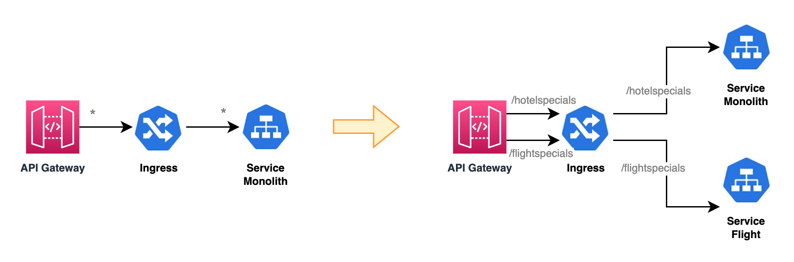
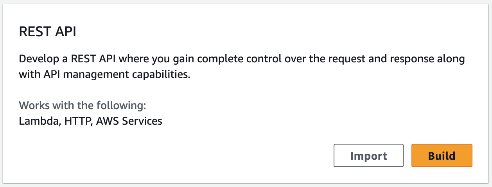

# API Gateway

## 개요

먼저 API Gateway를 활용하여 모노리스를 연결한 후, 분리할 API에 대해서 마이크로서비스를 추가합니다.

기대하는 아키텍처는 다음과 같습니다.

### 1단계: API Gateway를 추가

- Ingress 앞에 API Gateway를 추가합니다.
- 실습에서는 세부적인 설정이 가능하도록 REST API 타입으로 추가합니다.
  

### 2단계: Microservice 추가

- Microservice를 추가 배포
- 해당 API로 라우팅하는 path를 Ingress에 추가
- API Gateway에서 해당 path를 추가
