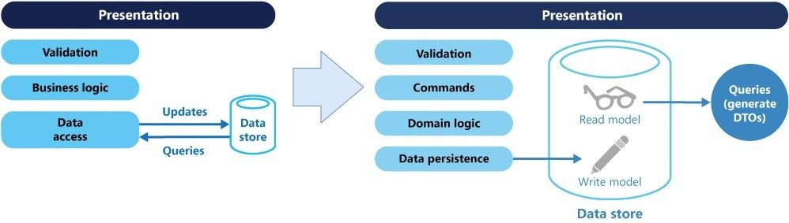
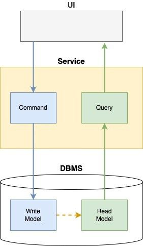
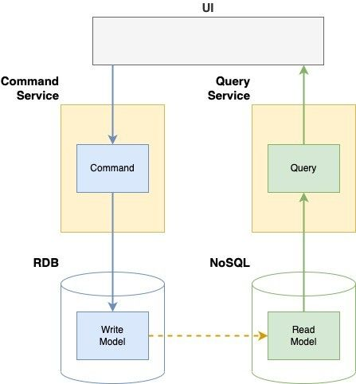
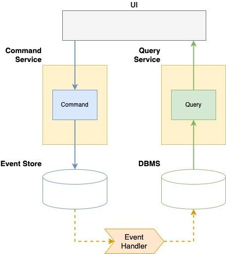

# CQRS

## Agenda

- CQRS는 무엇인가?
- 명령과 질의
- 왜 CQRS를 사용하는가?
- CQRS 구현
- CQRS 고려사항

## 개요

본 문서는 CQRS 패턴에 대해 간략하게 소개합니다.

## CQRS는 무엇인가?

- 명령과 질의 책임 분리 (Command and Query Responsibility Segregation)
- CQRS 는 Gregg Young 이 CQS 컨셉을 확장시켜 어플리케이션 레벨 이상에 적용한 패턴
- 애플리케이션의 기능을 명령(Command)과 질의(Query)로 분리
- 데이터를 쓰기 위한 모델(Write model)과 데이터를 읽기 위한 모델(Read model)을 분리

## 명령(Command)과 질의(Query)

### 명령(Command)

- 실행 가능한 동작을 나타내는 오퍼레이션
- 시스템의 상태를 변경하는 작업

### 질의(Query)

- Read-only 조회 연산
- 시스템의 상태를 조회하는 작업

## 왜 CQRS를 사용하는가?

- 명령(Command), 질의(Query)에 대한 데이터 모델 및 아키텍처를 별도로 최적화 가능
  - 각자의 데이터 모델 및 서로 다른 Database 사용
  - 조회 성능 개선
    - 미리 Join 해놓기
    - 캐시 사용 최적화
- 명령을 위한 서비스와 질의를 위한 서비스를 분리 가능
  - 트랜잭션 유형에 따라 명령과 질의를 처리하는 서비스 인스턴스의 수를 다르게 배치 가능
- 이벤트 소싱과 조합했을 때 유용함
  - 명령들을 이벤트 저장소에 저장했다가 리플레이 가능
  - 분산 데이터 저장소가 자연스럽게 "결과적 일관성"을 보장

## CQRS 구현

### 단일 데이터베이스

- 데이터베이스는 분리하지 않고 데이터 모델만 쓰기 모델과 읽기 모델로 분리하는 구조
- 단순하게 구현/적용 할 수 있지만, 단일 데이터베이스 사용에 따른 확장성의 제한은 개선하지 못함

### 데이터베이스 분리

- 쓰기 전용 데이터베이스와 읽기 전용 데이터베이스를 분리하고 데이터를 동기화
- 데이터를 조회하려는 대상 서비스들은 각자 자신의 서비스에 맞는 저장소(RDBMS, NoSQL, Cache)를 선택할 수 있음
- 단일 데이터베이스 사용에 따른 확장성 문제를 해결
- 동기화 처리의 신뢰성이 보장되어야 함

### 이벤트 소싱

- 모든 명령(Command)을 이벤트 형태로 별도의 이벤트 저장소(Event Store)에 저장
- 명령들을 이벤트 저장소에 저장했다가 리플레이 가능
- 분산 데이터 저장소가 자연스럽게 "결과적 일관성"을 보장
  - 강한 일관성 및 실시간 업데이트가 필요한 시스템에는 적합하지 않음

## CQRS 고려사항

- CQRS는 최적화를 위한 패턴
- 데이터베이스를 분리할 경우 데이터 복제 시차 및 결과적 일관성을 고려해야 함

## 레퍼런스

- [CQRS 패턴 by Martin Fowler](https://martinfowler.com/bliki/CQRS.html)
- [CQRS 패턴 in MSA](https://docs.aws.amazon.com/ko_kr/prescriptive-guidance/latest/modernization-data-persistence/cqrs-pattern.html)
- [CQRS 및 이벤트소싱](https://docs.aws.amazon.com/ko_kr/prescriptive-guidance/latest/patterns/decompose-monoliths-into-microservices-by-using-cqrs-and-event-sourcing.html)
