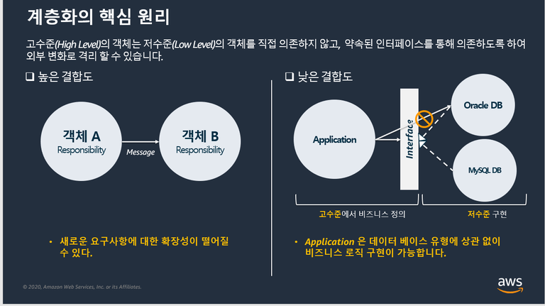
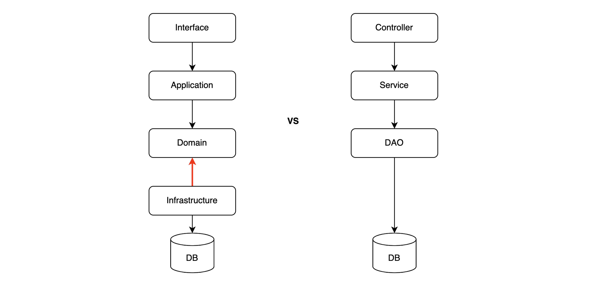
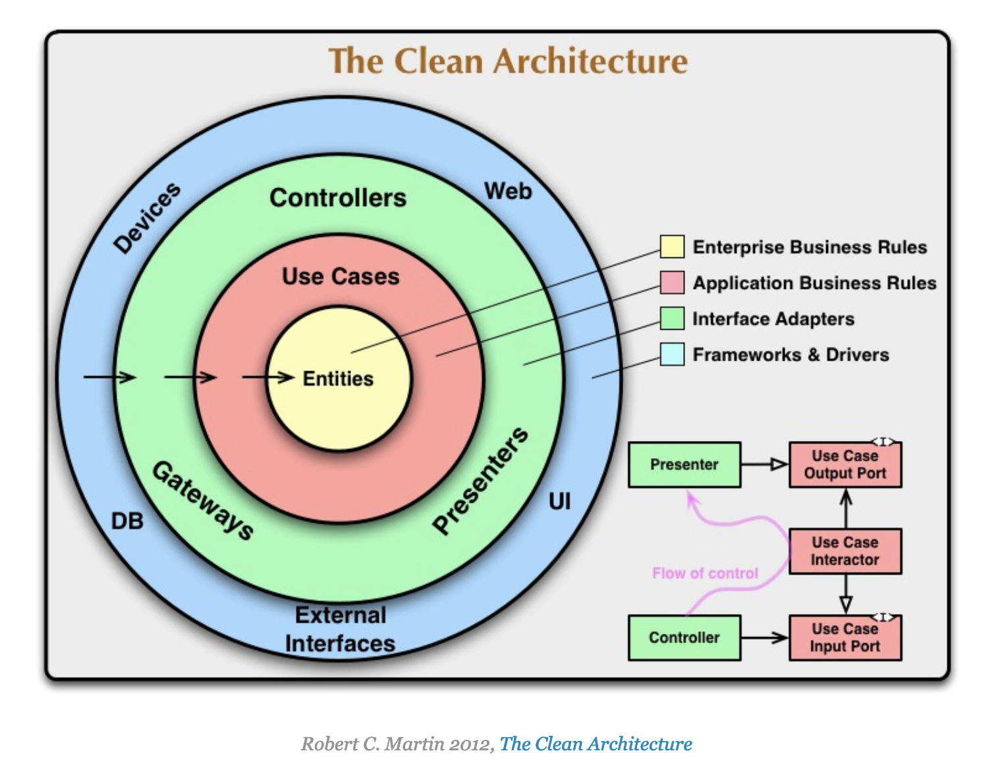

# 패키지 구조

## Agenda

- 계층화를 하는 이유
- Layered Architecture
- flightspecial 패키지 구조 설명

## 계층화를 하는 이유

계층화가 필요한 이유를 알아봅니다.

## Layered Architecture

클린 아키텍처를 기반으로 여기서 제안하는 layered architecture의 핵심은 domain layer와 infrastructure layer 간의 의존성 역전입니다.

Interface

- 인터페이스 계층 (Interface layer)
- client 와 communication 을 위한 interface
- 서비스 성격에 따라 web, api, message, batch
- presenting UI to end-user, 대화 해석

Application

- 서비스 계층 (Service layer)
- 고수준으로 추상화된 service(특정 행위 추상화) 객체 배치
- 시나리오에 따른 도메인 로직 호출
- 서비스 트랜잭션 관리

Domain

- 도메인 계층 (Domain layer)
- 비지니스 (도메인) 로직 관리
- 핵심 layer

Infrastructure

- 영속 계층 (Persistence layer)
- technical part, 세부 기술
- 서비스 및 비지니스와 구현 기술 분리
- DIP로써 다른 layer에 기술이 주입됨

## FlightSpecial Package 구조

- 네 가지 layer 별로 서브 프로젝트를 분리
- 서브 프로젝트 단위로 의존성을 정의하여 layer 간 의존성을 일부 강제화

### Multi-module Layer Architecture

- 의존성을 거스르는 호출을 아예 막을 수 있다.
- sub-module 단위의 프로젝트로 구성한다면 컨테이너 이미지 배포 단위 경량화 및 속도 향상

### Usecase, Repository 인터페이스

- 의존성 역전. _도메인 영역_ 등 안쪽영역이 바깥쪽 레이어의 변경의 영향을 받지 않는다.
- 레이어 별로 단위 테스트, 통합 테스트 등을 쉽게 할 수 있다. Mocking 및 Test Double 등을 손쉽게 사용 가능
- 일반 구현체를 사용하는 것에 비해 테스트가 쉽게 깨지지 않는다. (인터페이스가 안정적이므로 )

### 도메인 모델

- 도메인 모델의 장점은 객체 지향 설계에 기반한 재사용성, 확장성 및 유지보수성

### 장점

- 유지보수성: (관심사가 분리되어) 개발 변경 영향도 낮음
- 재사용성: 모듈별 배포 가능하여 안정성과 효율성 향상
- 서비스 확장성개발 생산성: (관심사가 분리되어) 서비스 추상화에 따른 가독성 증가
- 비지니스 로직과 기술로직의 의도적 분리로 테스트 향상

### 단점

- 컨벤션 준수에 따른 제약
- 간단한 시나리오라도 boilerplate 필요
- layer간 호출로써, 보다 많은 클래스 생성

## 레퍼런스: Clean Architecture

클린 아키텍처는 Robert C. Martin이 정리한 소프트웨어 시스템을 구축하는 방법론 중 하나로서 의존성 규칙, 추상화 원칙, 경계 분리 원칙 등을 기반으로 합니다.

