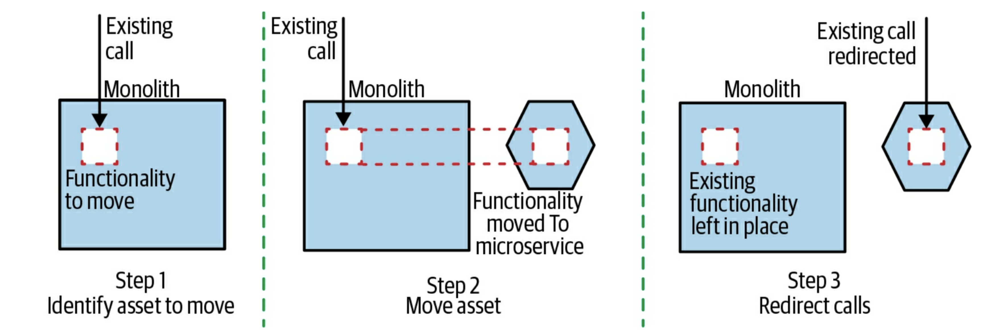
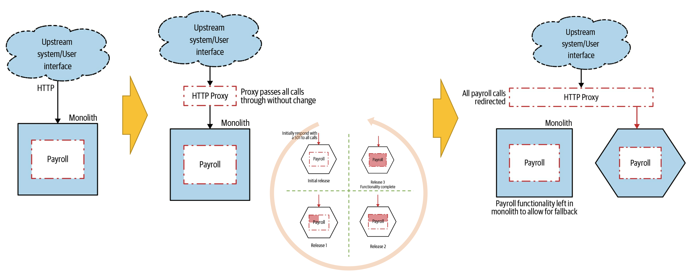

# Strangler-Fig Pattern

## Agenda

- 실행 순서
- 적용 대상
- 예시: HTTP Reverse Proxy

## 실행 순서

- Migrate할 대상 시스템의 구성 요소들을 식별
- 일종의 절충(trade-off)을 통해 시스템의 어느 부분을 먼저 처리할지 결정
- 새로운 microservice에서 이 기능을 구현
- 새로운 구현이 준비되면 기존 요청을 새로운 microservice로 rerouting

새 기능이 프로덕션 환경에 배포되어도 호출이 리디렉션될 때까지는 기술적으로 활성화되지 않는다는 점에 주목할 가치가 있다.

Strangler fig 패턴의 핵심이 점진적으로 migrate할 수 있는 것 뿐만 있는 것은 아니다. 오히려 우리는 변경에 대해 필요한 경우에 매우 쉽게 rollback할 수 있다는 점에 집중해야 한다. 우리는 항상 실수한다는 것을 잊지 말아야 한다.

> **Release와 Deployment를 분리**
>
> - Strangler Fig
> - Parallel run
> - Canary release
> - Feature toggle

## 적용 대상

- 기존 monolith를 다른 팀에서 꾸준히 작업해야 하는 경우 (reduce contention)
- Monolith가 타사 소프트웨어이거나 SaaS와 같은 black-box 시스템일 때
- 데이터에 대한 우려를 제외하고는 기능 조각을 외부로 추출하는 작업을 크게 단순화

## 예시: HTTP Reverse Proxy

HTTP는 요청을 가로채서 리다이렉트하기 용이한 특성을 가지므로 Strangler fig 패턴을 사용하여 migrate 가능하다.

- 1 단계 : Proxy를 삽입한다.
- 2 단계 : 여러 stage로 나누어 migrate할 기능을 구현한다.
  - 처음에는 `501 Not Implemented`를 반환하는 간단한 구현 만으로 상용 환경에 배포할 수 있다.
  - 이 단계에서는 기능을 deploy하지만 release하지 않은 상태를 유지한다.
- 3 단계 : 신규 microservice로 요청을 redirect한다.
